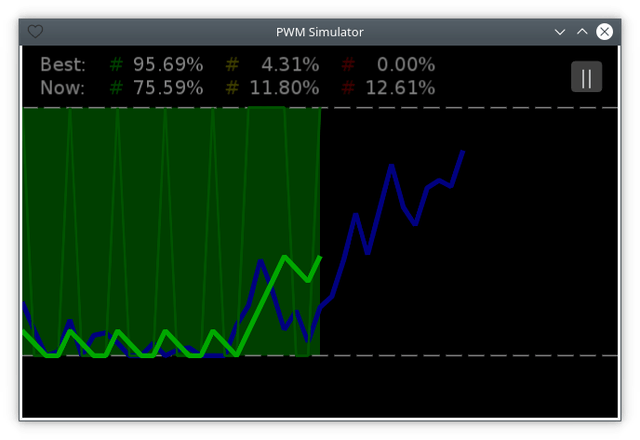

# Controls (EN / [RU](controls_ru.md))

[<< Back](README.md)

Hold the left mouse button or touch the right half of the screen to move the custom plot upward. Hold the right mouse button or touch the left half of the screen to move it downward at twice the normal speed. If both actions are held, the faster downward movement takes priority.

Press <kbd>Space</kbd> to toggle pause mode. You can also pause by clicking the <kbd>||</kbd> button and resume by clicking the <kbd>|></kbd> button.
