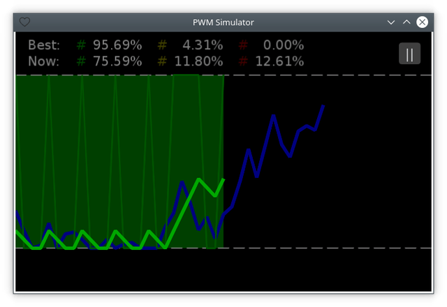

# Управление ([EN](controls.md) / RU)

[<< Назад](README_ru.md)

Удерживайте левую кнопку мыши (или касайтесь сенсорного экрана), чтобы пользовательский график шёл вверх. Удерживайте правую кнопку мыши, чтобы он шёл вниз с удвоенной скоростью. При одновременном нажатии обеих кнопок приоритет имеет правая.

Переход в режим паузы осуществляется посредством кнопки <kbd>||</kbd>. Выход из режима паузы — посредством кнопки <kbd>|></kbd>.
