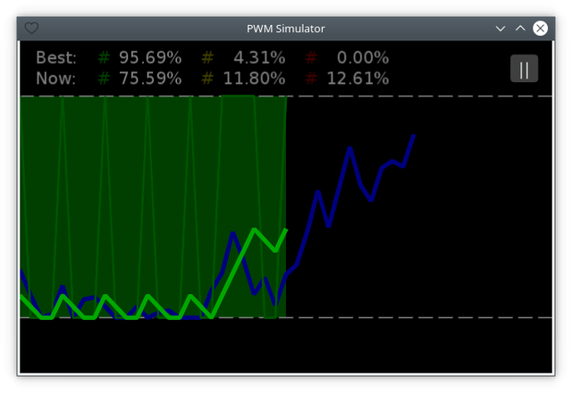

# Геймплей ([EN](gameplay.md) / RU)

[<< Назад](README_ru.md)

## Описание игрового поля

Игровое поле состоит из трех графиков: случайный график, пользовательский график и источник пользовательского графика.

Случайный график отображается синим цветом и занимает три четверти экрана.

Пользовательский график отображается светло-зелёным цветом и занимает половину экрана.

Источник пользовательского графика отображается зелёным цветом (не светлым) и занимает так же половину экрана. При этом его толщина в два раза меньше, чем толщина остальных графиков.

На фоне графиков отображается дистанция между случайным и пользовательским графиками:

- если дистанция меньше мягкого лимита, фон имеет зелёный цвет;
- если дистанция больше мягкого, но меньше жесткого лимита, то фон имеет жёлтый цвет;
- если дистанция больше жёсткого лимита, то фон имеет красный цвет.

Лимиты имеют следующие значения:

- мягкий лимит - одна треть от максимальной высоты графиков;
- жёсткий лимит - две трети от максимальной высоты графиков.
