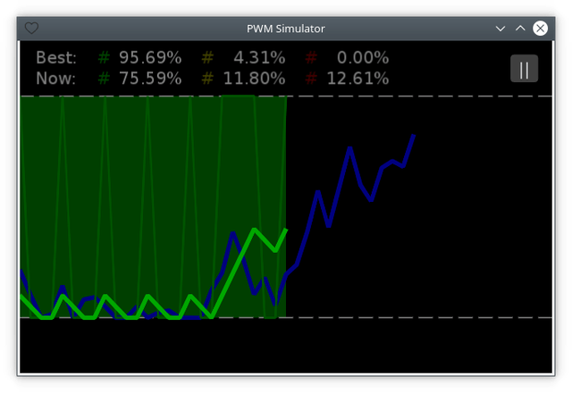

# Краткое описание ([EN](summary.md) / RU)

[<< Назад](README_ru.md)

**Синий** график отображает случайный аналоговый сигнал. **Зелёный** график отображает сигнал, получающийся из цифрового сигнала (см. ниже) пропусканием его через [RC-цепь](https://ru.wikipedia.org/wiki/RC-цепь).

Цифровой сигнал формируется пользователем: **при нажатии** на экран сигнал имеет **высокий** уровень, **иначе** — **низкий**.

Цель игры: максимально точно повторить форму синего графика зелёным.
